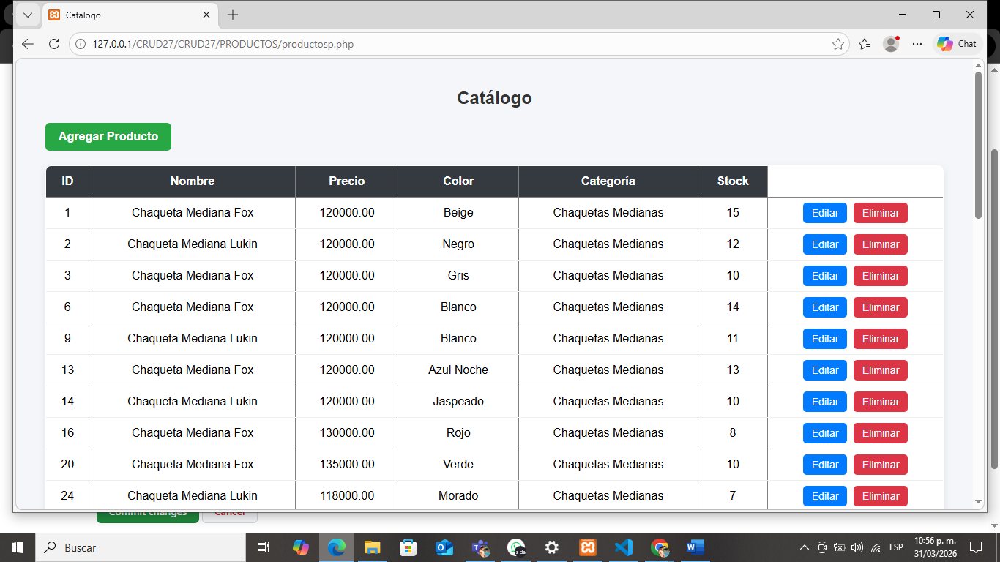
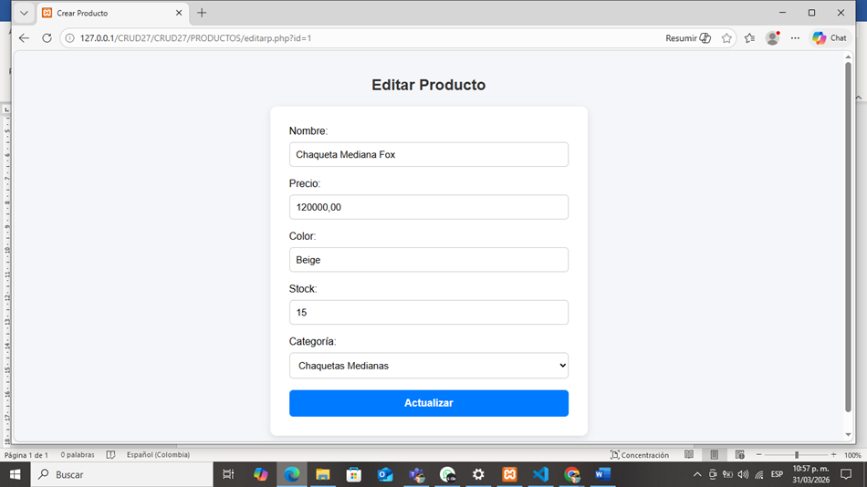
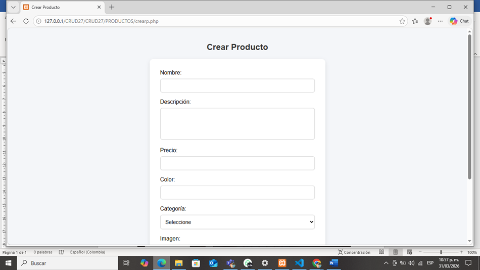

# Coat store Sitio Web
Tienda web de abrigos y chaquetas desarrollada con HTML, CSS, JavaScript y Bootstrap.
## Descripción
Coat Store es una página web diseñada para venta online de abrigos y chaquetas para mujeres.
Incluye catálogo de productos, carrito de compras y contacto directo por WhatsApp.

## FUNCIONALIDADES 
Catálogo de productos

Carrito de compras

Botón de compra por WhatsApp

Carrusel de imágenes

Formulario de contacto

## Catalogo niñas

## Contactenos formulario

## ¿Quienes somos?

# CRUD de Catálogo
Mi pagina permite desde vista de administrador, hacer el crud de mis productos.
## Descripción
Pagina web que permite gestionar un catálogo de productos mediante operaciones CRUD (crear, leer, actualizar y eliminar).

## Características
- Crear productos
- Listar productos
- Actualizar productos
- Eliminar productos

